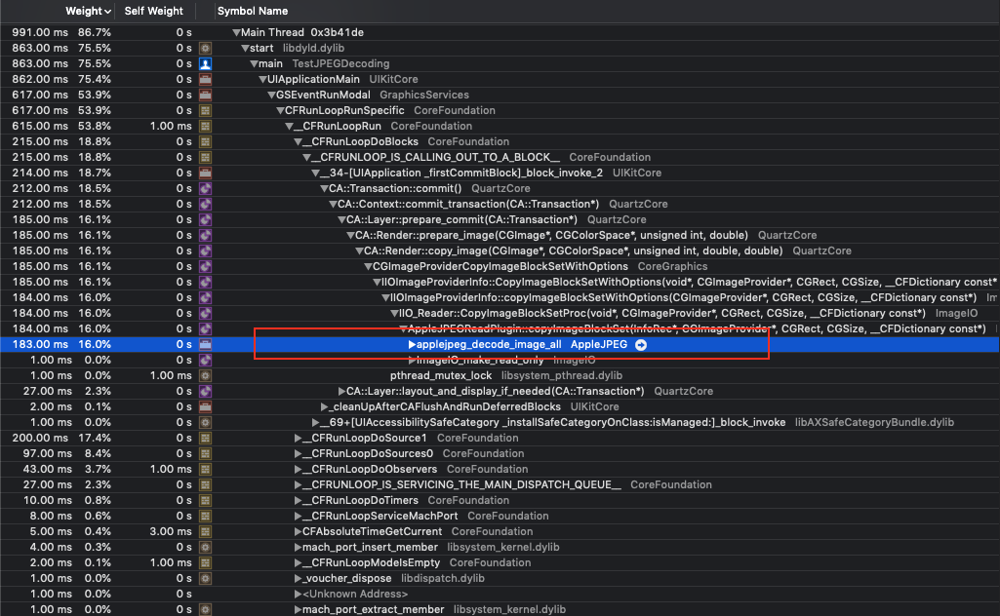

# UIImage JPEGDecoding

This is an extension for UIImage to avoid `applejpeg_decode_image_all`.\
Basically it's automatically invoked when you do something like:
```swift
imageView.image = anImage
```



## Usage
Make sure your call this method in background thread to not block main thread. And cache it somewhere for later use since we don't need to decode it again.
```swift
DispatchQueue.global().async {
  let image = anImage.decoded()
}
```
